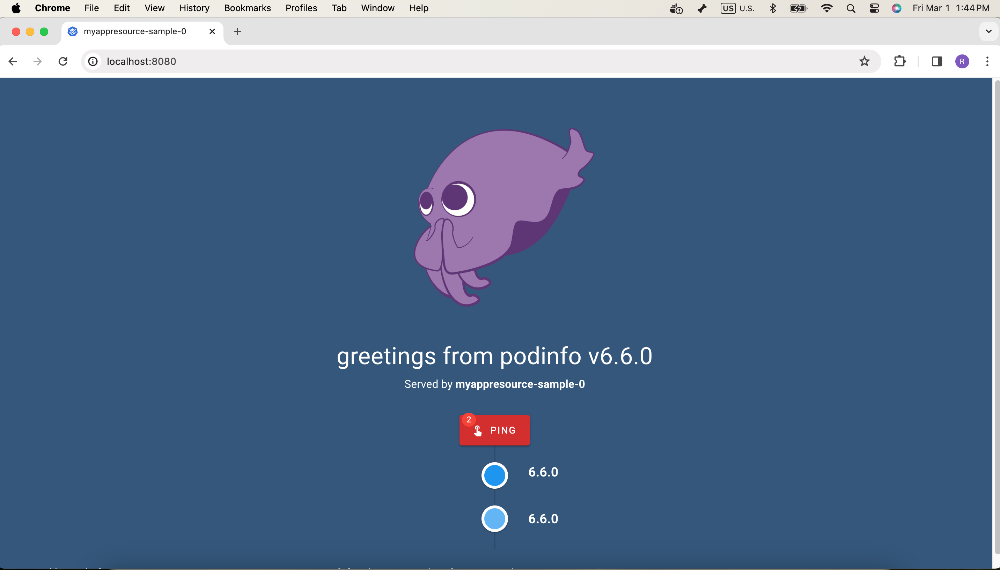

# Angiplatform
Welcome to Angiplatform! This project showcases proficiency in Kubernetes and the reconciliation controller pattern. The primary aim is to develop a controller that manages a custom resource for deploying an application and its associated data store within Kubernetes. The custom resource encapsulates the configuration required for deploying the application.


## Project Overview
In this project, we leverage the podinfo application, an open-source application, and Redis from DockerHub. These components are orchestrated within Kubernetes, with the application and Redis instances accessible via kube port forwarding.


## Getting Started

Follow the instructions below to set up and run the Angiplatform project locally:

### Prerequisites
- go version v1.21.0+
- docker version 17.03+.
- kubectl version v1.11.3+.
- Access to a Kubernetes v1.11.3+ cluster.
- Redis-cli


### Clone the repo 

```sh 
git clone https://github.com/kommineni24/Angiplatform.git
```

### To Deploy on the cluster

**Build and push your image to the location specified by `IMG`:**

Naviagate to the directory you cloned above and build/tag/push the docker image as below.

```sh
make docker-build docker-push IMG=<some-registry>/angiplatform:tag
```
**NOTE:** This image ought to be published in the personal registry you specified. 
And it is required to have access to pull the image from the working environment. 
Make sure you have the proper permission to the registry if the above commands don’t work.


**Install the CRDs into the cluster:**

```sh
make install
```

**Deploy the Manager to the cluster with the image specified by `IMG`:**

```sh
make deploy IMG=<some-registry>/angiplatform:tag
```

> **NOTE**: If you encounter RBAC errors, you may need to grant yourself cluster-admin 
privileges or be logged in as admin.


**Create instances of your solution**
You can apply the samples (examples) from the config/sample:

```sh
kubectl apply -k config/samples/
```

>**NOTE**: Ensure that the samples has default values to test it out.


### Application verification:

We will rely on kube port forwarding to access the podinfo and redis application.


**Port forwarding for `Podinfo Application and Redis instance`:**

Navigate to the namespace where your application, custom controller, and Redis are deployed.

Port-forwarding command for application:
```sh
kubectl port-forward pod/<application-pod-name> <local-port>:<container-port> -n <namespace>
```

>**NOTE**: Replace <application-pod-name> with the name of your application pod, <local-port> with the local port you want to use, <container-port> with the port where your application is running inside the container, and <namespace> with the namespace where your application pod is deployed.

For example:
```sh
kubectl port-forward pod/myappresource-sample-0 8080:9898 -n angiplatform-system
```


Browser Verification URL of application:
```sh
http://localhost:<local-port>
```

You should see a web page like below:



Port-forwarding command for Redis:
```sh
kubectl port-forward pod/<Redis-pod-name> <local-port>:<container-port> -n <namespace>
```

>**NOTE**: Replace <Redis-pod-name> with the name of your Redis pod, <local-port> with the local port you want to use for port-forwarding, and <container-port> with the port where Redis is running inside the container. Also, replace <namespace> with the namespace where your Redis pod is deployed.

For example:
```sh
kubectl port-forward pod/myappresource-sample-redis-6865dcff76-h8r7k 8081:6379 -n angiplatform-system
```


Verification of Redis:
Set key-value pair in Redis:
```sh
redis-cli -h 127.0.0.1 -p <local-port> set platform "Angi"
```

Retrieve value from Redis:
```sh
redis-cli -h 127.0.0.1 -p <local-port> get platform
```


### Tests:

Naviagte to the folder where our test suite files are and run:
```sh
gingko
```

### To Uninstall
**Delete the instances (CRs) from the cluster:**

```sh
kubectl delete -k config/samples/ -n <namespace>
```

**Delete the APIs(CRDs) from the cluster:**

```sh
make uninstall
```

**UnDeploy the controller from the cluster:**

```sh
make undeploy
```

## Project Distribution

Following are the steps to build the installer and distribute this project to users.

1. Build the installer for the image built and published in the registry:

```sh
make build-installer IMG=<some-registry>/angiplatform:tag
```

NOTE: The makefile target mentioned above generates an 'install.yaml'
file in the dist directory. This file contains all the resources built
with Kustomize, which are necessary to install this project without
its dependencies.

2. Using the installer

Users can just run kubectl apply -f <URL for YAML BUNDLE> to install the project, i.e.:

```sh
kubectl apply -f https://raw.githubusercontent.com/<org>/angiplatform/<tag or branch>/dist/install.yaml
```

## Contributing

**NOTE:** Run `make help` for more information on all potential `make` targets

More information can be found via the [Kubebuilder Documentation](https://book.kubebuilder.io/introduction.html)

## License

Copyright 2024 Ramakrishna Kommineni.

Licensed under the Apache License, Version 2.0 (the "License");
you may not use this file except in compliance with the License.
You may obtain a copy of the License at

    http://www.apache.org/licenses/LICENSE-2.0

Unless required by applicable law or agreed to in writing, software
distributed under the License is distributed on an "AS IS" BASIS,
WITHOUT WARRANTIES OR CONDITIONS OF ANY KIND, either express or implied.
See the License for the specific language governing permissions and
limitations under the License.

